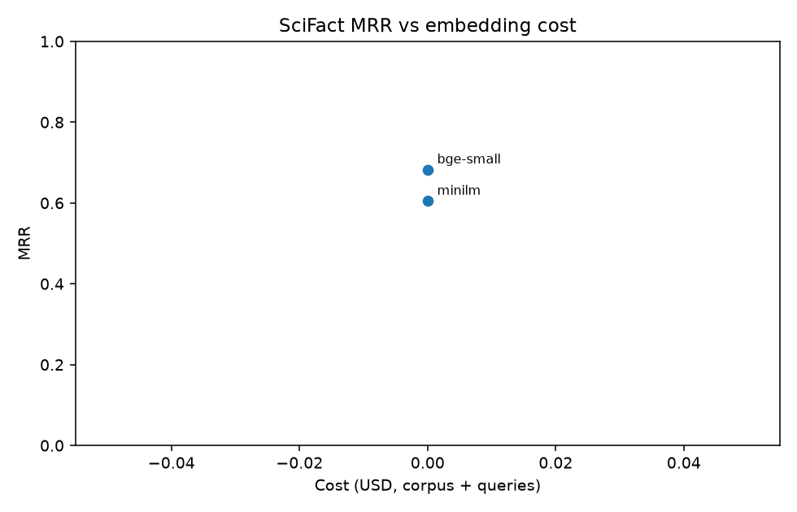
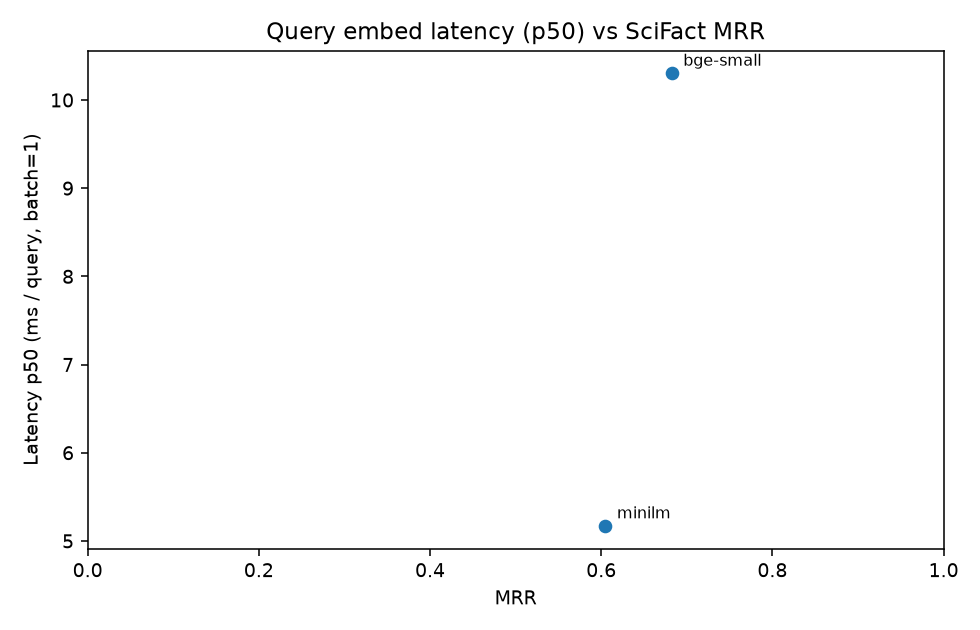

# embedbench

Reproducible side-by-side benchmark of embedding models on a fixed retrieval task — latency, cost, and accuracy.

## Leaderboard (BEIR SciFact test)

300 queries, 5,183 abstracts, cosine top-10. Local models run 2026-09-04 on CPU. API rows are implemented in-repo but **not run** (no keys configured).

| Rank | Model | Type | MRR | R@1 | R@5 | R@10 | p50 ms | p95 ms | Cost |
|------|-------|------|-----|-----|-----|------|--------|--------|------|
| 1 | `bge-small` (`BAAI/bge-small-en-v1.5`) | local | **0.682** | **0.607** | **0.780** | **0.847** | 10.3 | 12.2 | $0 |
| 2 | `minilm` (`all-MiniLM-L6-v2`) | local | 0.605 | 0.503 | 0.753 | 0.793 | **5.2** | **6.7** | $0 |
| — | `openai-3-small` | API | not run — key not configured | | | | | | |
| — | `openai-3-large` | API | not run — key not configured | | | | | | |
| — | `voyage-3-lite` | API | not run — key not configured | | | | | | |
| — | `cohere-embed-v3` | API | not run — key not configured | | | | | | |





CSV: [`results/benchmark_20260904.csv`](results/benchmark_20260904.csv). Manual retrieval dump: [`results/spotcheck.md`](results/spotcheck.md).

## Problem

Teams pick embedding models from blog posts. The same retrieval task, same k, and the same metrics make cost, latency, and quality comparable — and the run is one command.

## Dataset

[BEIR SciFact](https://github.com/allenai/scifact) test split from the official zip (this repo does **not** depend on the `beir` Python package):

- 5,183 scientific abstracts (corpus)
- 300 fact-checking queries with test qrels (queries without labels are dropped)
- qrels in `qrels/test.tsv`

Each corpus row is `title + text`. Use `--max-queries N` to subsample queries for a cheaper iteration loop; the numbers above use the full test split.

## Methodology

- **Task:** embed the corpus once, embed each query, brute-force cosine top-10.
- **k:** 10 for every model.
- **Recall@k:** fraction of queries with **at least one** gold document in the top-k (Success@k, not classic multi-relevant recall).
- **MRR:** mean reciprocal rank of the first relevant document (0 if none in the retrieved list).
- **Latency:** per-query embed time at **batch=1** (p50 / p95). A second pass at **batch=32** is recorded as `latency_batch_ms_per_query`.
- **Cost:** `(tokens_used / 1e6) * price_per_1m_tokens`. Local models report a whitespace token count for scale only; billed cost is $0.
- **Normalization:** embeddings are L2-normalized before cosine. BGE queries get the official instruction prefix from `configs/models.yaml`.
- **Hardware (this run):** Windows 11, CPU only (AMD64 Family 26 Model 68), no CUDA. PyTorch 2.14 / sentence-transformers 6.

**Statistical note:** 300 SciFact test queries is enough to rank models for a portfolio write-up; treat MRR gaps under ~0.02 as noisy.

## Insights

Both local models cost $0, so the comparison is quality vs CPU latency. API cost/quality triangles need keys (see Reproduce).

1. **`bge-small` is the quality pick; MiniLM is the latency pick.** bge reached 0.682 MRR vs MiniLM 0.605 (~+13% relative) at $0, but ~2× slower on this CPU (10.3 vs 5.2 ms p50 at batch=1).
2. **The gap is mostly first-hit, not “is it in the list?”** Recall@1 is +10 pp for bge (0.607 vs 0.503); Recall@10 shrinks to +5 pp (0.847 vs 0.793). If a reranker or a reader looks at ten hits, MiniLM is closer. If the first hit has to be right, bge earns the extra milliseconds.
3. **Batching dwarfs the model gap for throughput, not for interactive QPS.** Batch=32 cuts per-query embed time ~3–4× (bge 10.3→3.1 ms, MiniLM 5.2→1.4 ms). Below a few dozen QPS, CPU local embed is not the bottleneck; pick on Recall@1. On a hot path that already budgets single-digit milliseconds, MiniLM is the one that fits.

Spot-check (MiniLM, query `1`, “0-dimensional biomaterials show inductive properties.”): the gold nanotech/stem-cell abstract landed at **rank 5**, behind other stem-cell and biomaterials papers. Neighbors can look right while the labeled paper is not first — first-hit metrics are strict for a reason.

## Limitations

- Single English dataset (SciFact). Rankings may not transfer to code, chat, or multilingual corpora.
- No fine-tuning, rerankers, or ANN indexes — brute-force cosine only.
- API providers are implemented but skipped without keys, so the public table is local-only until someone re-runs with `OPENAI_API_KEY` / `VOYAGE_API_KEY` / `COHERE_API_KEY`.
- Query latency includes Python/SDK overhead, not a production embedding service.
- Local token counts are whitespace approximations; they are not billed.

## Reproduce

Python 3.11+ (this repo pins 3.12 via `.python-version`). [uv](https://docs.astral.sh/uv/) is used for the lockfile.

```powershell
python -m uv sync
python -m uv run python -m embedbench.benchmark --config configs/models.yaml --models bge-small,minilm --spot-check 1
```

Unix:

```bash
./scripts/run_benchmark.sh --models bge-small,minilm
```

Windows PowerShell:

```powershell
./scripts/run_benchmark.ps1 --models bge-small,minilm
```

`make reproduce` is the same local-only command if you have `make`.

API models (spends money):

```powershell
python -m uv run python -m embedbench.benchmark --models openai-3-small,openai-3-large,voyage-3-lite,cohere-embed-v3
```

Copy `.env.example` to `.env` first.

## Adding a model

See [CONTRIBUTING.md](CONTRIBUTING.md). Short version: add a YAML row; implement a provider only if the vendor is new.
