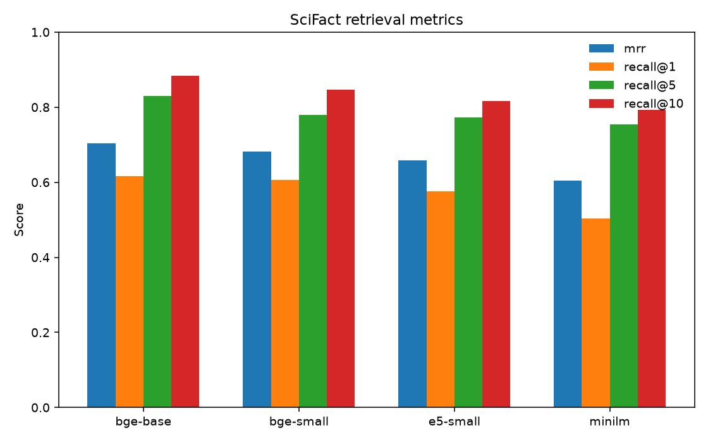

# embedbench

Reproducible side-by-side benchmark of embedding models on a fixed retrieval task — latency, cost, and accuracy.

## Leaderboard (BEIR SciFact test)

300 queries, 5,183 abstracts, cosine top-10. Local models run 2026-09-04 on an **RTX 5070** (CUDA). API rows are implemented in-repo but **not run** (no keys configured).

| Rank | Model | Type | Dim | MRR | R@1 | R@5 | R@10 | p50 ms | p95 ms | Cost |
|------|-------|------|-----|-----|-----|-----|------|--------|--------|------|
| 1 | `bge-base` (`BAAI/bge-base-en-v1.5`) | local | 768 | **0.703** | **0.617** | **0.830** | **0.883** | 5.1 | **6.2** | $0 |
| 2 | `bge-small` (`BAAI/bge-small-en-v1.5`) | local | 384 | 0.682 | 0.607 | 0.780 | 0.847 | 5.0 | **6.1** | $0 |
| 3 | `e5-small` (`intfloat/e5-small-v2`) | local | 384 | 0.658 | 0.577 | 0.773 | 0.817 | 4.9 | 7.0 | $0 |
| 4 | `minilm` (`all-MiniLM-L6-v2`) | local | 384 | 0.605 | 0.503 | 0.753 | 0.793 | **3.3** | 6.4 | $0 |
| — | `openai-3-small` | API | | not run — key not configured | | | | | | |
| — | `openai-3-large` | API | | not run — key not configured | | | | | | |
| — | `voyage-3-lite` | API | | not run — key not configured | | | | | | |
| — | `cohere-embed-v3` | API | | not run — key not configured | | | | | | |




All four local models cost $0, so the cost scatter is a vertical line until API keys are configured: [`results/mrr_vs_cost.png`](results/mrr_vs_cost.png).

CSV: [`results/benchmark_20260904.csv`](results/benchmark_20260904.csv). Manual retrieval dump: [`results/spotcheck.md`](results/spotcheck.md).

## Problem

Teams pick embedding models from blog posts. The same retrieval task, same k, and the same metrics make cost, latency, and quality comparable — and the run is one command.

## Dataset

[BEIR SciFact](https://github.com/allenai/scifact) test split from the official zip (this repo does **not** depend on the `beir` Python package):

- 5,183 scientific abstracts (corpus)
- 300 fact-checking queries with test qrels (queries without labels are dropped)
- qrels in `qrels/test.tsv`

Each corpus row is `title + text`. Use `--max-queries N` to subsample queries for a cheaper iteration loop; the numbers above use the full test split.

## Methodology

- **Task:** embed the corpus once, embed each query, brute-force cosine top-10.
- **k:** 10 for every model.
- **Recall@k:** fraction of queries with **at least one** gold document in the top-k (Success@k, not classic multi-relevant recall).
- **MRR:** mean reciprocal rank of the first relevant document (0 if none in the retrieved list).
- **Latency:** per-query embed time at **batch=1** (p50 / p95). A second pass at **batch=32** is recorded as `latency_batch_ms_per_query`.
- **Cost:** `(tokens_used / 1e6) * price_per_1m_tokens`. Local models report a whitespace token count for scale only; billed cost is $0.
- **Normalization:** embeddings are L2-normalized before cosine. Prefixes come from `configs/models.yaml`: BGE queries use the official instruction string; E5 uses `query: ` / `passage: `.
- **Hardware (this run):** Windows 11, NVIDIA GeForce RTX 5070 (CUDA). Local `sentence_transformers` models load on GPU when `torch.cuda.is_available()`.

**Statistical note:** 300 SciFact test queries is enough to rank models for a portfolio write-up; treat MRR gaps under ~0.02 as noisy.

## Insights

All four local models cost $0, so the comparison is quality vs GPU latency. API cost/quality triangles need keys (see Reproduce).

1. **`bge-base` is the quality pick on this GPU; MiniLM is still the latency pick, but the gap is small.** Base reached 0.703 MRR vs MiniLM 0.605 (~+16% relative) at $0, while batch=1 p50 is 5.1 vs 3.3 ms. On CUDA, the 110M model is not the 2× penalty it is on CPU.
2. **Same-size families are not interchangeable.** `e5-small` and `bge-small` are both ~33M / 384-d, yet bge leads 0.682 vs 0.658 MRR at essentially the same ~5 ms. The YAML prefixes (`query:` / `passage:` vs BGE’s instruction) are part of the model, not decoration.
3. **`bge-base` vs `bge-small` is a Recall@10 story more than a first-hit story.** MRR only moves +0.021 (right on the noise line) and Recall@1 +1 pp (0.617 vs 0.607). Recall@10 jumps +3.7 pp (0.883 vs 0.847). If a reranker already reads ten hits, paying for base is easier to justify than if the first hit has to be right.
4. **Batch=1 on GPU is overhead-bound; batch=32 is where size shows up.** MiniLM 3.3→0.17 ms/query, bge-small 5.0→0.39, e5-small 4.9→0.30, bge-base 5.1→0.65. Interactive QPS barely distinguishes the BGE/E5 row; throughput does. Pick MiniLM only when the hot path already budgets ~3 ms and Recall@1 can be 0.50.

Spot-check (MiniLM, query `1`, “0-dimensional biomaterials show inductive properties.”): the gold nanotech/stem-cell abstract landed at **rank 5**, behind other stem-cell and biomaterials papers. Neighbors can look right while the labeled paper is not first — first-hit metrics are strict for a reason.

## Limitations

- Single English dataset (SciFact). Rankings may not transfer to code, chat, or multilingual corpora.
- No fine-tuning, rerankers, or ANN indexes — brute-force cosine only.
- API providers are implemented but skipped without keys, so the public table is local-only until someone re-runs with `OPENAI_API_KEY` / `VOYAGE_API_KEY` / `COHERE_API_KEY`.
- Query latency includes Python/SDK overhead, not a production embedding service.
- Local token counts are whitespace approximations; they are not billed.
- GPU batch=1 times are not comparable to the earlier CPU-only MiniLM/bge-small figures in git history.

## Roadmap

- Second BEIR set (for example nfcorpus) so rankings are not SciFact-only.
- nDCG@k and bootstrap CIs on the 300-query MRR gaps.
- API leaderboard once keys exist (`openai-3-small` / `voyage-3-lite` make the cost chart real).
- Multi-model spot-check for the same query (bge-small already missed gold on query `1`).

## Reproduce

Python 3.11+ (this repo pins 3.12 via `.python-version`). [uv](https://docs.astral.sh/uv/) is used for the lockfile.

```powershell
python -m uv sync
python -m uv run python -m embedbench.benchmark --config configs/models.yaml --models bge-small,minilm,e5-small,bge-base
```

`uv sync` installs CPU PyTorch. To match this README’s GPU latencies on NVIDIA:

```powershell
python -m uv pip install --python .venv --torch-backend cu128 --reinstall-package torch torch
.\.venv\Scripts\python.exe -m embedbench.benchmark --models bge-small,minilm,e5-small,bge-base
```

(`uv run` re-syncs the lockfile and will replace the CUDA wheel with CPU torch.)

Unix:

```bash
./scripts/run_benchmark.sh --models bge-small,minilm,e5-small,bge-base
```

Windows PowerShell:

```powershell
./scripts/run_benchmark.ps1 --models bge-small,minilm,e5-small,bge-base
```

`make reproduce` is the same local-only command if you have `make`.

API models (spends money):

```powershell
python -m uv run python -m embedbench.benchmark --models openai-3-small,openai-3-large,voyage-3-lite,cohere-embed-v3
```

Copy `.env.example` to `.env` first.

## Adding a model

See [CONTRIBUTING.md](CONTRIBUTING.md). Short version: add a YAML row (`query_prefix` / `document_prefix` if the model needs them); implement a provider only if the vendor is new.
